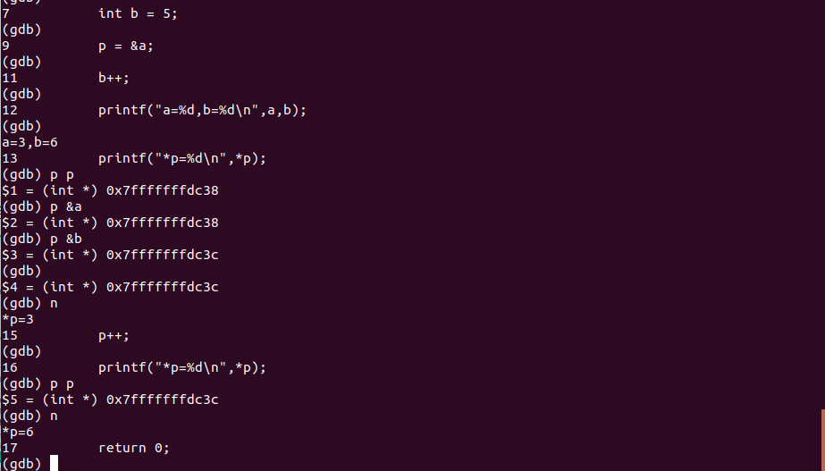

#
学习C语言的指针

##学习资料  
观看视频《Linux C语言指针与内存》：https://www.imooc.com/learn/394

昨天学习了下C语言的指针,主要通过看上面的视频资料,确实不错,能让我这个小白也大致明白了指针是什么,指针能做什么.

按照我个人理解,我觉得指针是这样的:
1. 指针也是一个变量,是变量就意味着可以存放值,不同于普通的变量,指针存放的值是内存地址;
2. 指针的声明是这样的"数据类型 *变量名",比如`int *p`,这条代码就是声明了一个整型的指针变量p,当然还有其他类型的比如字符类型,浮点类型等
3. 指针也可以做运算,指针的运算是对于内存地址的运算,这里用一段代码演示下比较明了

如上面代码所示,我们在调试模式下执行程序,执行到13行的时候,我们打印下变量a,b的地址以及p的地址,这里都没什么问题,变量a的地址赋值给了P,而在11行的时候我们给b做了自增运算,最后值打印出来从5变成了6,这也跟我们平常接触的运算一样,当程序执行到15行时,我们给p做了自增运算然后打印p的地址,发现p的值不是简单的做+1运算而是从 **0x7fffffffdc38**变成了 **0x7fffffffdc3c**????why?这里就要说下一个整型变量占用4个字节,之前我们也提到过指针的本质就是内存地址,所以这边操作系统为了保证数据的完整性,我们这边所做的自增会+4,也就是说,指针的运算其实就是指针的偏移,所以最后做了自增以后打印的值是6.

C语言之所以能开发出这么多牛逼的程序,指针功不可没,它能直接与内存打交道.

这是本人学了一天指针的理解,很浅薄,各位不要见笑.
